# REFURBISHED MODELING LANGUAGE (RML)


|            | Info                                                         |
| ---------- | ------------------------------------------------------------ |
| author:    | [KornSW](https://github.com/KornSW) + [derVodi](https://github.com/derVodi) |
| license:   | [Apache-2](https://choosealicense.com/licenses/apache-2.0/)  |
| version:   | 1.0.0                                                        |
| timestamp: | 2018-02-23                                                   |


## What is RML

…it is an enhanced flavor of UML‚ containing some fine-tuning "from engineers for engineers".
This ideas were developed under a permanent "eat your own dog food" approach!
Our diagrams containing more details which allows us to create charts  containing enough detail to be used as technical specification for the  guys which have to code. These guys don't want to ask "on-demand" trying to discover what the author of a diagram wanted to describe. We don't want to replace UML, but it has little scopes for interpretation, were trying to close...

For Example, look at the gigantic discussions in forums about the exact semantics of the "Aggregation"-Connector or missing Detail depth with "use case" diagrams.


# The RML „Entity Model“


### Basics

A connector always visualizes the **pointing direction outgoing from the foreign key**:

- On Primary Entity side we have a ARROW or a DIAMOND!

- On Foreign Entity side we have a CIRCLE or a UNDECORATED end (or a DIAMOND, if we have a reverse-addressed principal)

  

### Multiplicity

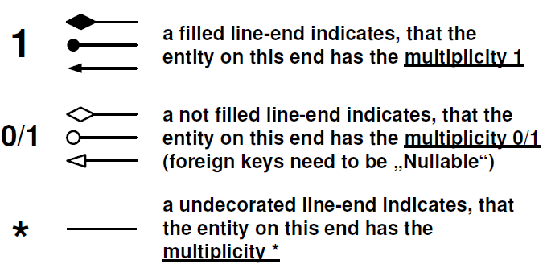


### Relation Types


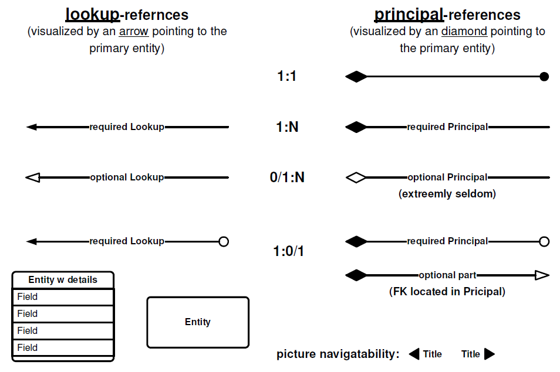


### N:M Relations

N:M relations requiring a junction-entity - and usually we want this to be expatiated!
But you can use a simplification! If a junction-entity has no attributes,
then this notation can be used:

 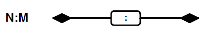


#### The "Aggregation" symbol in URL

**NOTE THAT:**
Everyone knows about the meaning of this symbol:

  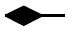

BUT: the all-around differences about the exact meaning of the symbol:

  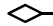

ruined its interpretability!


**WHAT WE DID:** We kept the diamond shape to indicate a
"Principal"-relation anyway!
If the symbol is filled up or not does not make any
statement about the role of a relation!
It just follows the global rule for visualization of
multiplicities.
(and we know that a "optional principal" is very seldom!)


### XOR – References

for picturing advanced relations like:

- supporting competating targets
- supporting the TPC inheritance pattern
- supporting „Complex Types“ (structures used by multiple adapters)

  

#### Variants

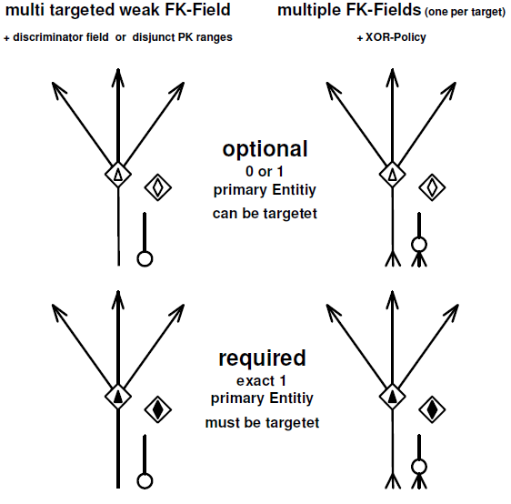

#### Rules

* Outgoing from the foreign entity (where FK is located) there is ALWAYS a regular connector!

* The XOR node symbol represents a virtual connector-end for all targeted primary entities.

* Incoming to each possible targeted primary entity there is ALWAYS a XOR Target-end connector (which is a elongation! The end decoration has no semantical statement about the relations multiplicity or role – this is represented by the symbol within the center of the XOR node)

* XOR Target-end connectors can only point AWAY from the XOR node symbol

* XOR node symbols are only valid when they have:

  ```
  (exact 1 incomming regular connector
  AND >1 outgoing XOR end connector)
  OR
  (>1 incomming regular connector AND
  exact 1 outgoing XOR end connector)
  ```


#### Samples


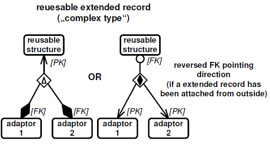


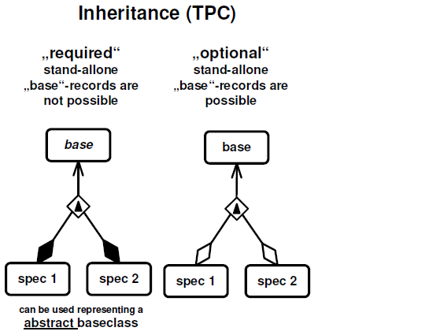


### The following must not be part of the chart:

- markers for „weak“-references
- markers for integrity automatisms (like „CascadeDelete“)

##### BECAUSE:

During the modeling phase we want to specify the relationship between entities as exact as possible in order to describe the reality. This should be regardless concerning the possibilities and features of any
technology! Integrity needs to be consistent each time. This Job must be done anyway! Which technical component or layer carries this responsibility (SQL-Server or BL-Code) does no matter for a model definition! 


# The RML „UX Flow“ Chart


…is  the next generation of the UseCase diagram containing more details  which allows us to create a chart containing enough detail to be used as  technical specification for the UI implementation team and/or the UX engineers!


### **Basics:**

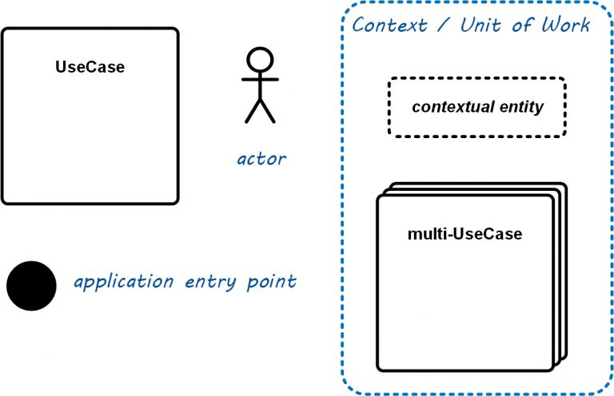


**Navigation**

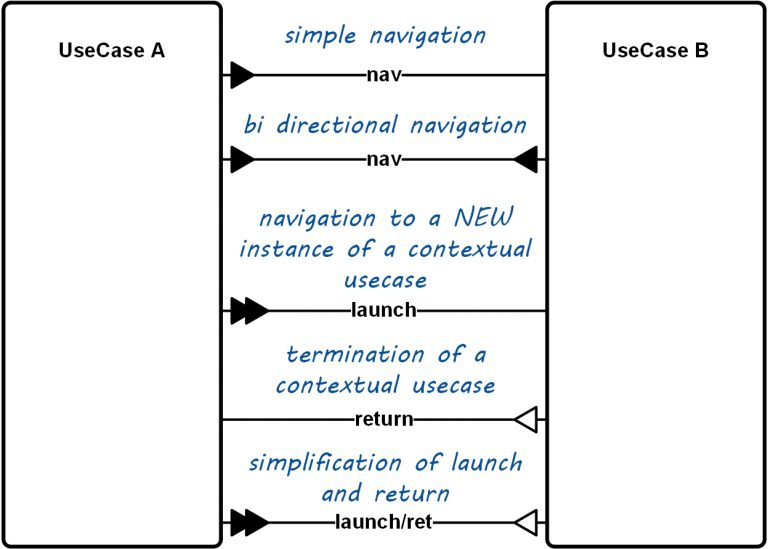


### **Inheritance & Aggregation**

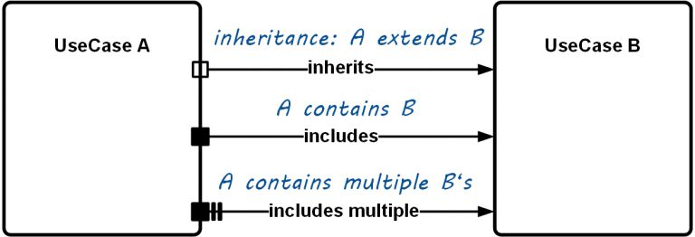


### **Event Flow**

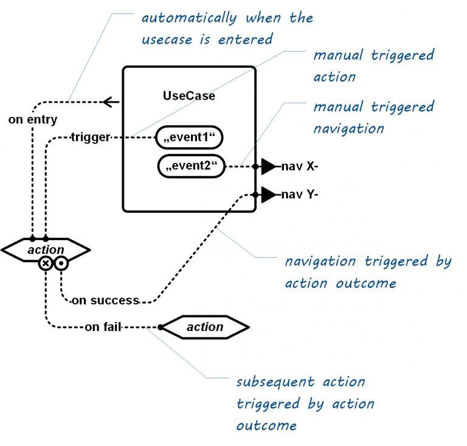

### **Sample**


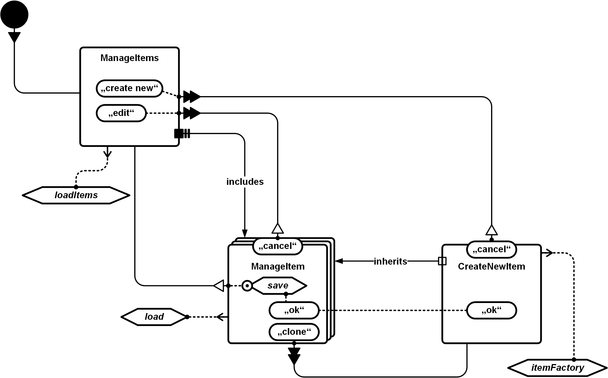


# Downloads


### **Entity-Model cheat sheet (PDF):**

[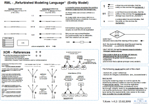](Documentation/RML-Entity-Model.pdf)


### **Shape Packages for Microsoft Visio:**

[RML-UxFlow Shapes ](http://refurbished-modeling-language.org/wp-content/uploads/2019/11/RML-UxFlow.zip)

[RML-EntityModel Shapes for MS Visio](http://refurbished-modeling-language.org/wp-content/uploads/2019/11/RML-EntityModel.zip)       


### **Shape Packages for Draw.IO:**

(coming soon…)


### **Please refer to us using this logo:**


 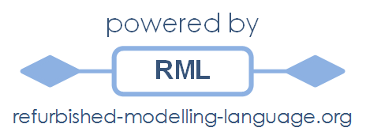